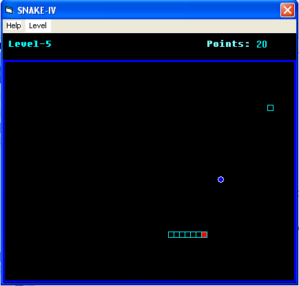



## Snake\-IV

### Description

This code for the game "Snake"
 
### More Info
 
Select the level first, then

press appropriate arrow keys to move it up,down,left,right . if it hits the side or if its hits itself, game would get over.

             |
---                |---
**Submitted On**   |2005-07-18 10:00:08
**By**             |[Prajith\.m\.s](https://github.com/Planet-Source-Code/PSCIndex/blob/master/ByAuthor/prajith-m-s.md)
**Level**          |Beginner
**User Rating**    |5.0 (15 globes from 3 users)
**Compatibility**  |VB 6\.0
**Category**       |[Games](https://github.com/Planet-Source-Code/PSCIndex/blob/master/ByCategory/games__1-38.md)
**World**          |[Visual Basic](https://github.com/Planet-Source-Code/PSCIndex/blob/master/ByWorld/visual-basic.md)
**Archive File**   |[Snake\-IV1914607182005\.zip](https://github.com/Planet-Source-Code/prajith-m-s-snake-iv__1-61753/archive/master.zip)

